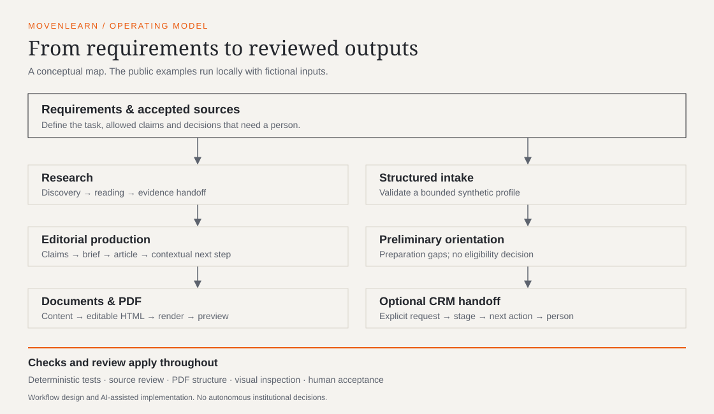
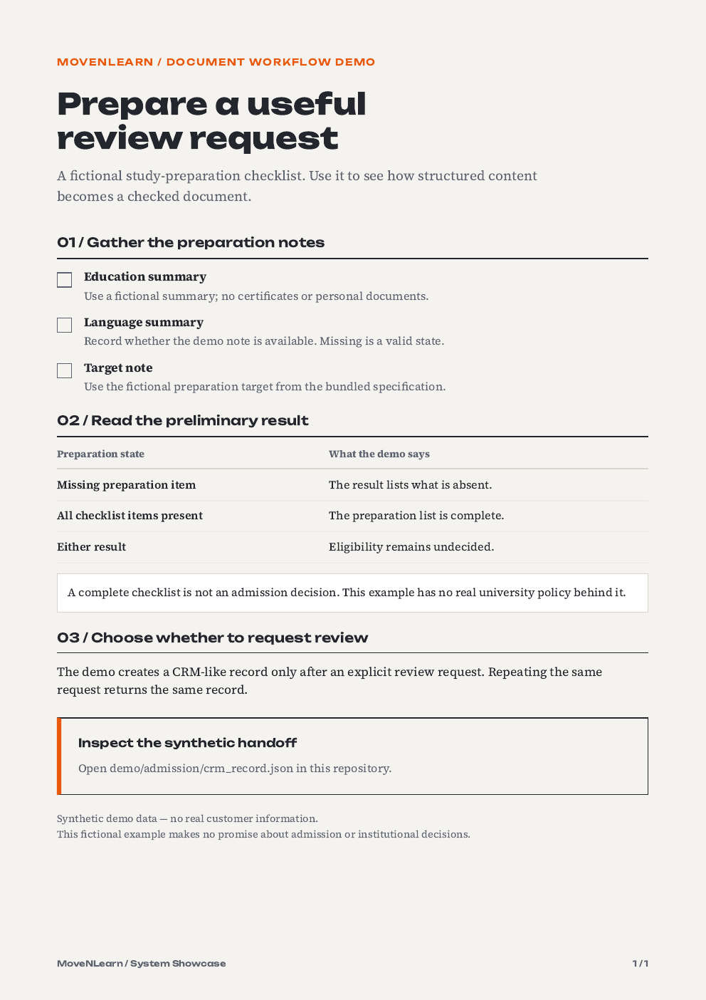
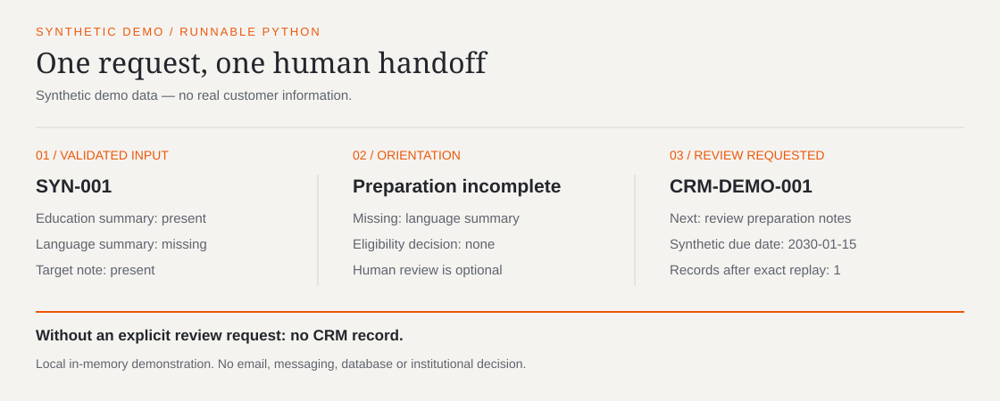

# MoveNLearn - System Showcase

[](https://github.com/DaniilSerhi/movenlearn-system-showcase/actions/workflows/ci.yml)

MoveNLearn is a founder-led digital education project focused on the path to studying in Germany.

This repository is a sanitized public case study of the internal workflows behind the project: structured intake and CRM handoff, research-backed editorial production, document generation, and quality controls.

It is not the production repository or a complete SaaS platform. It contains no customer data or production credentials.

**Synthetic demo data — no real customer information.**



**A checked document, produced from editable HTML:**

[](demo/pdf/sample.pdf)

## Why this exists

The interesting work sits between the visible pages: defining what an intake form should collect, when a person must make a decision, how a claim reaches an article, and how an editable document becomes a checked PDF.

This case study makes those choices inspectable. It combines a small executable example with documents and outputs that can be read without installing anything.

**Start here:** [intake result](demo/admission/preliminary_result.json), [sample PDF](demo/pdf/sample.pdf), or [article and its claim ledger](demo/editorial/final-article.md).

## What is demonstrated

| Capability | Open the proof | Evidence boundary |
| --- | --- | --- |
| Structured intake and CRM handoff | [Python demo](demo/admission/intake.py) | Local synthetic records; no production backend |
| Document production | [HTML, PDF and preview](demo/pdf/README.md) | One checked sample; visual judgment remains necessary |
| Editorial workflow | [Brief, ledger and article](demo/editorial/research-brief.md) | Claims use explicitly fictional fixture sources |
| Research handoff | [Evidence and handoff](demo/research/handoff.md) | Offline reconstruction, not a live prospect search |
| QA and governance | [Checks and review boundaries](docs/quality-and-governance.md) | Checks apply to this repository, not the private system |

### 1. Structured intake and CRM handoff

A valid profile produces a deterministic preparation result. The demo creates a CRM-like record only when the user requests human review. Replaying the same submission returns the existing record; reusing its identifier with different content raises a conflict.

The record includes a stage, next action, synthetic due date and initial history entry. It contains no email address, phone number or identity document. No database, API, account or network connection is required.

**Preliminary orientation ≠ eligibility decision.** The rules describe preparation completeness for a fictional service. They do not decide whether anyone can enter a university.



[Read the product flow](docs/product-flow.md).

### 2. Document / PDF production

The document example starts with [structured content](demo/pdf/sample-content.json) and [design requirements](demo/pdf/design.md). A small builder produces editable HTML. Chrome renders it; Poppler checks the physical PDF and creates the preview.

The design uses A4 pages, Unbounded and Source Serif 4, warm paper, a restrained orange accent, tables without vertical rules and reusable checklist, callout and action blocks. The example contains fictional preparation instructions, not current admissions advice.

A machine can count pages and find required sections. A reviewer still needs to assess clipping, legibility and composition. [See the production workflow](docs/document-production.md).

### 3. Research-backed editorial workflow

The miniature case follows intent, research, a claim ledger, an article brief, writing, a contextual next step and QA. Each article claim links to an included fixture source. The fixture is labeled as fictional throughout; it supplies no real university requirements.

The writing rules are practical: no empty introductions, fake expertise, unsupported claims, keyword stuffing, artificial length or repetitive summaries. These are a public explanation of the approach, not a copy of a private editorial prompt.

[Follow the miniature editorial case](docs/editorial-system.md).

### 4. Research tooling

The research example separates a discovery candidate from an accepted source and an accepted claim. It records scope and uncertainty before handing a finding to the next workflow.

The private working model uses external Agent-Reach tooling around Exa/mcporter and Jina. This repository demonstrates the handoff format with local fixtures and makes no external research calls. Agent-Reach is attributed to its upstream project.

[Inspect the research handoff](demo/research/handoff.md) and [tool attribution](docs/third-party-tools.md).

### 5. Quality and governance

Requirements define allowed behavior before implementation. The intake tests exercise rejection, deterministic output, the opt-in boundary, replay and conflict handling. PDF verification checks the rendered file. A publication verifier checks the worktree and Git history for defined private-data and credential patterns.

Automated checks support review. They cannot certify every statement, detect all sensitive information or replace a human decision to publish.

## How AI is used

Implementation and iteration are carried out extensively with AI coding agents. Requirements, examples and review criteria constrain the work. Outputs are checked against those requirements before acceptance.

The intake demo itself uses ordinary deterministic Python. It calls no language model. There is no proprietary AI model or autonomous admissions agent in this repository.

## Daniil's contribution

Daniil Serhieiev defines the product logic, workflow requirements, information architecture, review criteria and operational boundaries. AI coding agents and existing tools support implementation and iteration.

The value demonstrated here is product and workflow design, requirements definition, AI-assisted implementation, validation and operational thinking. The repository does not present agent-generated implementation as code written entirely by hand.

[Contribution and boundaries](docs/contribution-and-boundaries.md) distinguish these responsibilities. The final publication decision remains Daniil's.

## Repository map

- `docs/`: architecture, workflows, governance, attribution and limitations.
- `demo/admission/`: synthetic input, deterministic implementation and generated JSON.
- `demo/pdf/`: design specification, content, HTML, PDF and preview.
- `demo/editorial/`: research brief, claim ledger, article brief, article and QA checklist.
- `demo/research/`: fictional sources, discovery candidates, evidence and handoff.
- `assets/`: architecture and intake diagrams, plus licensed fonts.
- `scripts/`: demo runner, document builder and verification commands.
- `tests/`: behavioral and publication-safety regression tests.

## Run the demos / tests

Use Python 3.10 or later. The intake demo and unit tests use only the standard library.

```bash
python3 scripts/run_admission.py
python3 -m unittest discover -s tests -v
python3 scripts/verify_public_repo.py
python3 scripts/check_links.py
```

The demo prints a readable report with preparation gaps, the human review handoff and replay checks. Use `--json` for a machine-readable summary. To deliberately regenerate the demo files:

```bash
python3 scripts/run_admission.py --write
```

PDF generation additionally needs Chrome/Chromium and Poppler's `pdfinfo`, `pdftotext`, `pdftoppm` and `pdffonts` commands. The publication verifier also needs Poppler, including its `pdfdetach` command. Fonts are included under their upstream licenses, so rendering does not fetch them.

```bash
python3 scripts/build_pdf.py
python3 scripts/render_pdf.py
python3 scripts/verify_pdf.py
```

The [CI workflow](.github/workflows/ci.yml) runs unit tests and local link checks on pushes to `main` and pull requests. PDF rendering and the full publication scan remain separate local checks.

Open `demo/pdf/preview.png` after rendering. Review the image and extracted text before accepting any new document. [Validation notes](docs/validation.md) record the checks performed for this version.

## Third-party tools and limitations

Hallmark and Hallmark PDF are external local workflows used during preparation, not MoveNLearn applications. Their private/local instructions and scripts are not distributed here. The public renderer is a small implementation provided in this repository.

[Third-party tools](docs/third-party-tools.md) covers ownership and dependencies. [Known limitations](docs/known-limitations.md) explains the synthetic scope, human review boundary and absence of revenue or product-market-fit claims.

## Public product

[MoveNLearn's public website](https://movenlearn.academy) is the external product. This repository is a separate, sanitized internal-system case study; it does not contain the website's production source.

